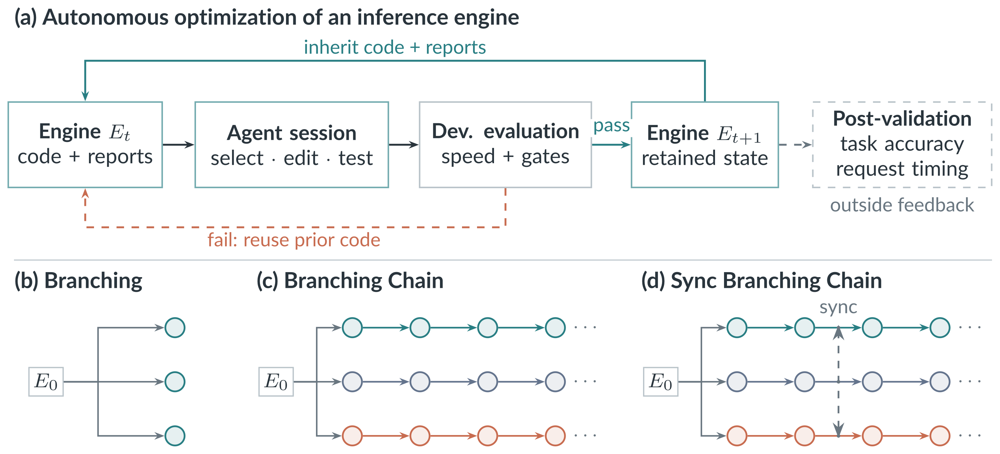

# SEIS: Self-Evolving Inference Systems

Zhen Xu · Jingyu Liu · Zongze Li · Tahseen Rabbani · Ce Zhang

University of Chicago

**Preprint, 2026** · [Paper (arXiv)](https://arxiv.org/abs/2610.04646) · [Code](https://github.com/smth-fun/self-evolving-inference-system)

## Autonomous optimization. Across the whole inference stack.

Faster inference makes language models cheaper to serve. **SEIS gives AI agents a working inference engine and lets them improve it end to end.** Across successive sessions, agents investigate bottlenecks, rewrite code, test their changes, and build on the code and reports left by earlier sessions. Parallel chains can also exchange discoveries.

Starting from mini-sglang, the agents developed optimized GPU kernels, fused operators, improved runtime execution, and prompt-lookup speculative decoding. The agent stays fixed throughout; the engine's implementation evolves.



*Engine code and reports pass between sessions; synchronized chains share discoveries.*

## An evolved engine. A substantial speedup.

On **Qwen3-0.6B, NVIDIA H100, and single-request inference**, the best evolved engine achieves:

- **3.27× throughput** over the original mini-sglang engine: 594 → 1,942 tokens per second.
- **89 ms mean request latency**, down from 295 ms.
- **3.08× throughput without speculative decoding**, from kernel and runtime changes.

Natural-request throughput compared with the selected production configurations:

| Engine | Throughput (tokens/s) |
| --- | ---: |
| mini-sglang (original) | 594 |
| vLLM | 633 |
| SGLang | 626 |
| TensorRT-LLM | 690 |
| **SEIS (best engine)** | **1,942** |

These measurements use 100 natural-length requests, with prefill included. Throughput is the median of three repetitions. Production configurations were selected on development data; see Figure 1 and Appendix E of the paper.

The best engine's observed accuracy changes are **+1.06 percentage points on GSM8K** and **−0.37 on long-input retrieval**, relative to the original engine.

## Better systems through accumulated work.

- **Build on earlier sessions.** Inherited code and reports let agents combine improvements over time. In these experiments, sustained chains outperform independent attempts.
- **Share useful discoveries.** Exchanging code across chains spreads working designs. The best engine combines its own kernels and runtime with a peer's decoding policy.
- **Keep checking capability.** Speed and development checks tell only part of the story. Held-out task evaluation and code inspection expose failures that the optimization score misses.

## Citation

```bibtex
@article{xu2026seis,
  title   = {{SEIS}: Self-Evolving Inference Systems},
  author  = {Xu, Zhen and Liu, Jingyu and Li, Zongze and
             Rabbani, Tahseen and Zhang, Ce},
  journal = {arXiv preprint arXiv:2610.04646},
  year    = {2026}
}
```
